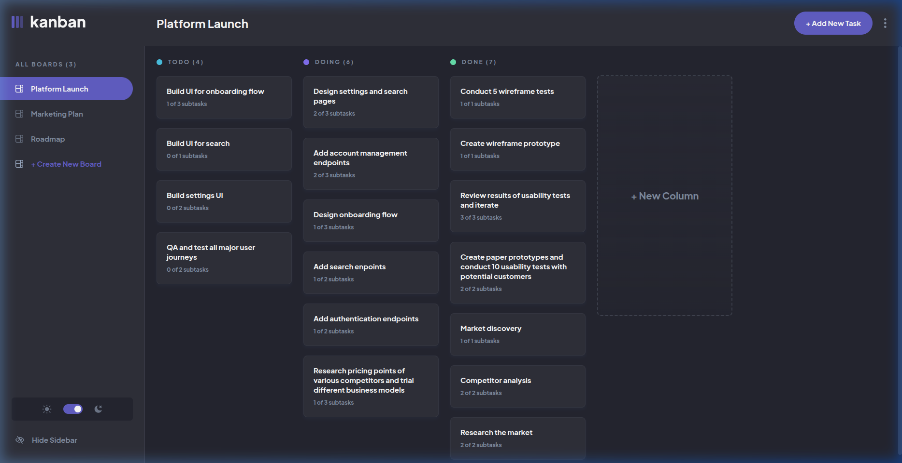

# Frontend Mentor - Kanban task management web app solution

This is a solution to the [Kanban task management web app challenge on Frontend Mentor](https://www.frontendmentor.io/challenges/kanban-task-management-web-app-wgQLt-HlbB). Frontend Mentor challenges help you improve your coding skills by building realistic projects.

## Table of contents

- [Overview](#overview)
  - [The challenge](#the-challenge)
  - [Screenshot](#screenshot)
  - [Links](#links)
- [My process](#my-process)
  - [Built with](#built-with)
  - [What I learned](#what-i-learned)
  - [Continued development](#continued-development)
  - [Useful resources](#useful-resources)
  - [AI Collaboration](#ai-collaboration)
- [Author](#author)
- [Acknowledgments](#acknowledgments)

## Overview

### The challenge

Users should be able to:

- View the optimal layout for the app depending on their device's screen size (Mobile 375px, Tablet 768px, Desktop 1440px)
- See hover and active states for all interactive elements on the page
- Create, read, update, and delete boards and tasks
- Receive form validations when trying to create/edit boards and tasks (prevent empty titles or empty items)
- Mark subtasks as complete and move tasks between columns
- Hide/show the board sidebar on desktop and tablet
- Open the mobile navigation dropdown modal on smaller screens
- Toggle the theme between light and dark modes with persistent preferences
- **Bonus**: Keep track of any changes across sessions using `localStorage` persistence
- **Bonus**: Custom landing page and intuitive onboarding flow for empty boards and empty columns

### Screenshot



### Links

- GitHub Repository: [https://github.com/fawaziwalewa/kanban-task-management-web-app](https://github.com/fawaziwalewa/kanban-task-management-web-app)
- Live Site URL: [https://main-umber-pi-58.vercel.app](https://main-umber-pi-58.vercel.app)
- Solution on Frontend Mentor: [https://www.frontendmentor.io/solutions/kanban-task-management-web-app---nextjs-16-tailwind-css-and-typescript-4293yudJ27](https://www.frontendmentor.io/solutions/kanban-task-management-web-app---nextjs-16-tailwind-css-and-typescript-4293yudJ27)

## My process

### Built with

- Semantic HTML5 markup
- CSS custom properties & Design System Tokens
- Flexbox & CSS Grid
- Mobile-first responsive layout architecture
- [React 19](https://react.dev/) - JavaScript UI library
- [Next.js 16 (App Router)](https://nextjs.org/) - React Framework with Turbopack
- [TypeScript](https://www.typescriptlang.org/) - Strict type safety across boards, columns, tasks, and subtasks
- [Tailwind CSS v4](https://tailwindcss.com/) - Utility-first CSS framework with custom `@custom-variant dark` support
- Context API & Custom Hooks with `localStorage` synchronization

### What I learned

Working on this comprehensive challenge allowed me to implement advanced component architecture, strict type handling, robust modal management, and smooth responsive design.

#### 1. Tailwind CSS v4 Class-Based Dark Mode
To support seamless switching between Light and Dark themes via a root HTML class in Tailwind CSS v4:
```css
@import "tailwindcss";

@custom-variant dark (&:where(.dark, .dark *));

@theme {
  --color-primary: #635fc7;
  --color-primary-hover: #a8a4ff;
  --color-destructive: #ea5555;
  --color-destructive-hover: #ff9898;
  --color-dark-bg: #20212c;
  --color-dark-surface: #2b2c37;
  --color-dark-lines: #3e3f4e;
  --color-light-bg: #f4f7fd;
  --color-light-surface: #ffffff;
  --color-light-lines: #e4ebfa;
}
```

#### 2. Robust Dropdown Layering Over Modal Boundaries
To prevent custom status dropdown menus from being clipped by modal dialog borders (matching the exact Figma specifications):
```tsx
export function Modal({ isOpen, onClose, title, children }: ModalProps) {
  if (!isOpen) return null;
  return (
    <div className="fixed inset-0 z-50 flex items-center justify-center p-4 bg-black/50">
      {/* overflow-visible allows absolute dropdown menus to float over the dialog */}
      <div className="relative w-full max-w-[480px] bg-white dark:bg-dark-surface rounded-lg p-6 sm:p-8 overflow-visible shadow-xl">
        {title && <h2 className="text-lg font-bold text-black dark:text-white mb-6">{title}</h2>}
        {children}
      </div>
    </div>
  );
}
```

#### 3. Board & Task State Immutability
Ensuring all CRUD operations update state immutably and instantly persist to `localStorage`:
```typescript
const updateTask = (boardId: string, updatedTask: Task) => {
  setBoards(prevBoards =>
    prevBoards.map(board => {
      if (board.id !== boardId) return board;
      return {
        ...board,
        columns: board.columns.map(col => ({
          ...col,
          tasks: col.tasks.map(task => (task.id === updatedTask.id ? updatedTask : task)),
        })),
      };
    })
  );
};
```

### Continued development

Future enhancements planned for this project include:
- **Full-Stack Persistence**: Connecting to a PostgreSQL database via Prisma/Supabase for authenticated multi-device sync.
- **Drag-and-Drop Animations**: Enhancing drag and drop task moving across columns with `@dnd-kit/core` and smooth physics animations.
- **Real-Time Collaboration**: Adding live updates via WebSockets so teams can collaborate on boards concurrently.

### Useful resources

- [Frontend Mentor](https://www.frontendmentor.io) - Invaluable real-world design specifications and Figma assets.
- [Next.js Documentation](https://nextjs.org/docs) - App Router guides and best practices for React 19.
- [Tailwind CSS v4 Documentation](https://tailwindcss.com/docs) - Reference for modern theme tokens and CSS variables.

### AI Collaboration

This project was built with the assistance of **Antigravity AI (Google DeepMind)**. 

- **Figma Translation**: Transformed pixel-perfect Figma designs (desktop, tablet, and mobile states) into responsive React components and Tailwind CSS tokens.
- **Form Validation & State**: Crafted dynamic array form helpers for adding/removing subtasks and board columns with error handling.
- **Code Quality & Testing**: Automated layout verification across viewport sizes (375px, 768px, 1440px), ensured zero ESLint/TypeScript errors, and addressed React 19 client hydration constraints.

## Author

- Website - [Fawaz Iwalewa](https://iwaola.me/)
- Frontend Mentor - [@fawaziwalewa](https://www.frontendmentor.io/profile/fawaziwalewa)
- GitHub - [@fawaziwalewa](https://github.com/fawaziwalewa)
- Twitter - [@iwalewa_fawaz](https://x.com/iwalewa_fawaz)

## Acknowledgments

Thanks to Frontend Mentor for providing such a well-crafted design challenge and comprehensive Figma files.
